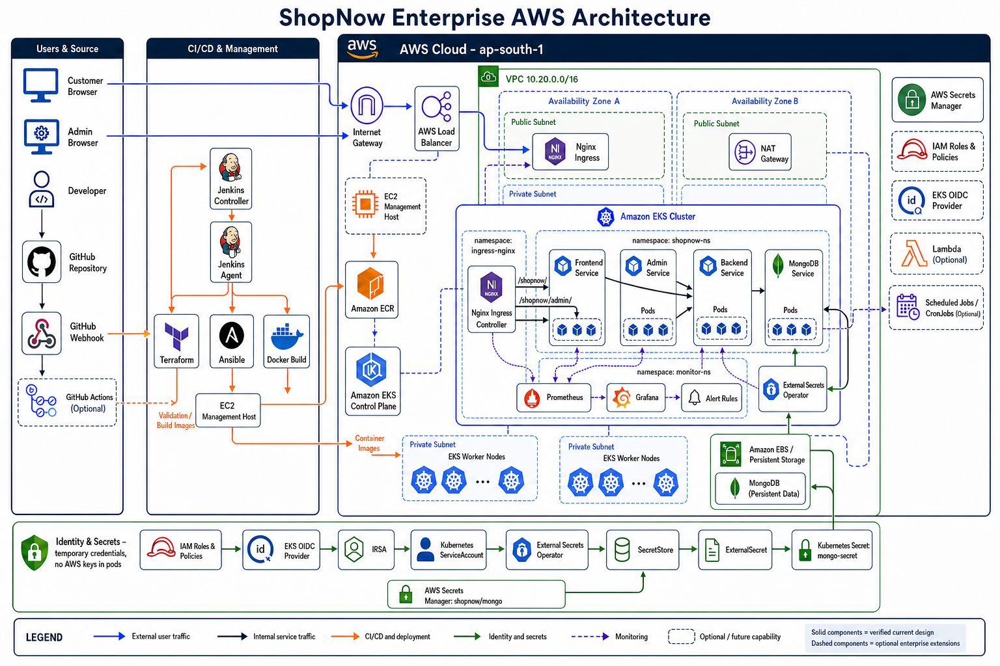
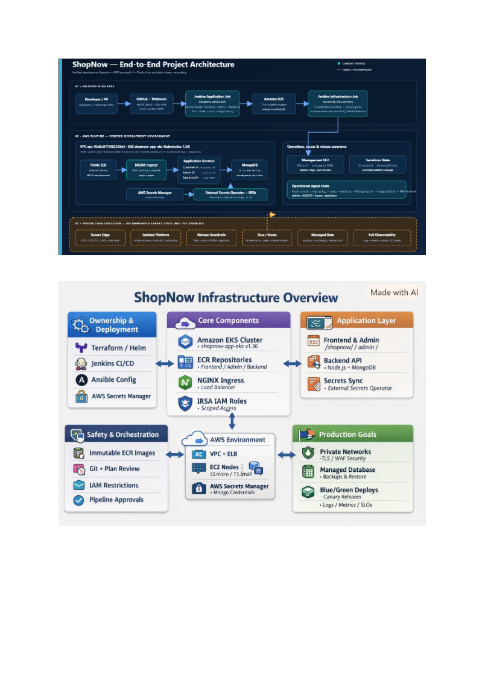
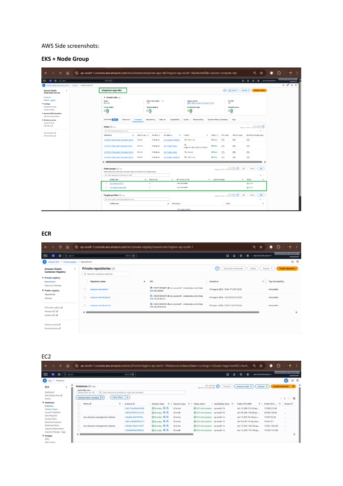
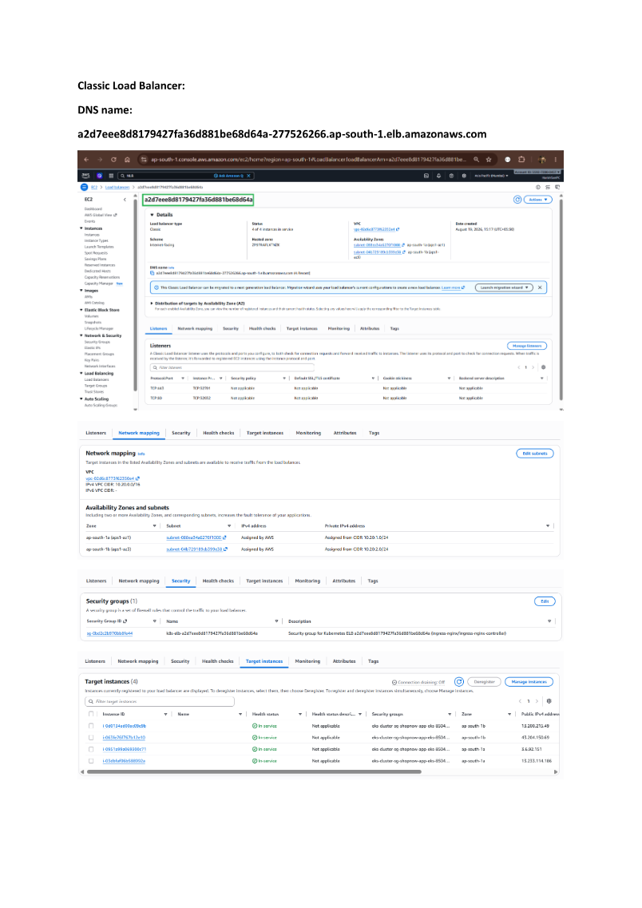
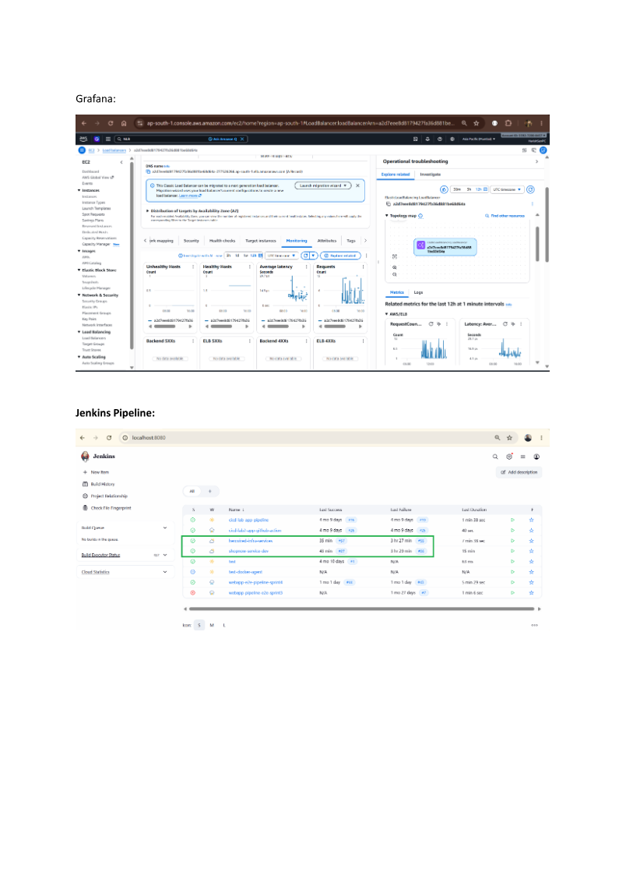

# HeroVired Infrastructure

HeroVired Infrastructure is the cloud and DevOps project for [ShopNow](https://github.com/harishmsgit/shopNow). It creates the AWS environment, configures the management host, deploys ShopNow to Kubernetes, synchronizes database secrets, and monitors the application.

## Project at a glance

| Area | Tool | Purpose |
|---|---|---|
| Infrastructure | Terraform | AWS network, IAM, EC2, and EKS |
| Configuration | Ansible | Management-host setup and validation |
| Containers | Docker and ECR | ShopNow application images |
| Orchestration | Kubernetes | Runs all application components |
| Automation | Jenkins | Infrastructure and deployment pipeline |
| Secrets | AWS Secrets Manager, External Secrets | MongoDB credentials |
| Monitoring | Prometheus, Grafana | Application and cluster health |

## Architecture

### Enterprise AWS architecture



The diagram brings the complete platform into one view:

- Blue paths show customer and administrator traffic entering through the Internet Gateway and AWS load balancer, then reaching Nginx Ingress.
- Dark paths show private application traffic between frontend, admin, backend, and MongoDB Services.
- Orange paths show source, build, provisioning, image, and deployment activity. GitHub webhooks trigger Jenkins; Jenkins runs Terraform, Ansible, and Docker build/deployment stages.
- Green paths show IAM/OIDC/IRSA and Secrets Manager synchronization into `mongo-secret` without storing AWS keys in pods.
- Purple dotted paths show metrics collection and dashboard/alert processing.
- Public and private subnet boxes show the intended network boundaries across two availability zones.
- Dashed optional boxes represent enterprise extensions, not verified current workloads.

Current versus optional scope:

| Status | Components |
|---|---|
| Verified current design | GitHub webhook, Jenkins, Terraform, Ansible, ECR, EKS, Nginx Ingress, ShopNow workloads, IAM, OIDC/IRSA, External Secrets, Secrets Manager |
| Repository capability, not currently deployed | Prometheus, Grafana, alert rules in `monitor-ns` |
| Optional enterprise extension | GitHub Actions, Lambda, Kubernetes CronJobs/scheduled jobs, dedicated persistent EBS topology |

> GitHub webhook traffic is CI/CD control traffic to Jenkins. Customer and administrator traffic never passes through Jenkins; it enters AWS through the public load-balancer path.

```text
GitHub repositories
  -> Jenkins pipeline
  -> Terraform creates AWS infrastructure
  -> Ansible configures the management host
  -> Amazon ECR stores ShopNow images
  -> Amazon EKS runs ShopNow
  -> Nginx Ingress routes application traffic
  -> Prometheus and Grafana monitor the deployment
```

### Architecture steps

1. Application code is stored in the `shopNow` repository.
2. Infrastructure and deployment configuration is stored here.
3. Jenkins starts the pipeline after a reviewed change.
4. Terraform creates or updates the AWS network, IAM, EC2, and EKS.
5. Ansible configures and validates the management host.
6. ShopNow Docker images are stored in Amazon ECR.
7. External Secrets reads the MongoDB secret from AWS Secrets Manager.
8. Kubernetes deploys MongoDB, backend, frontend, admin, and ingress.
9. The AWS load balancer exposes the application routes.
10. Prometheus and Grafana monitor the deployment.

## Deployment sequence

```text
Developer pushes a change
  -> Jenkins validates the project
  -> Terraform plans and creates AWS resources
  -> Jenkins deploys the ECR images to Kubernetes
  -> Kubernetes starts the pods
  -> Readiness checks confirm the rollout
```

## Project structure

```text
herovired-infra/
|-- terraform/                 # AWS infrastructure
|-- ansible/                   # Host configuration
|-- kubernetes/
|   |-- k8s-manifests/         # Application resources
|   |-- external-secrets/      # Secret integration
|   `-- monitoring/            # Prometheus and Grafana
|-- docker/jenkins-agent/      # Jenkins agent image
|-- scripts/                   # Automation helpers
|-- Jenkinsfile                # Main pipeline
`-- README.md
```

## Prerequisites

AWS CLI, Terraform, kubectl, Helm, Ansible, Docker, Jenkins, Python, and `jq`.

```bash
aws --version
terraform version
kubectl version --client
helm version
ansible --version
docker --version
```

## Step-by-step deployment

### 1. Clone and verify AWS access

```bash
git clone https://github.com/harishmsgit/herovired-infra.git
cd herovired-infra
aws sts get-caller-identity
```

Examples use region `ap-south-1` and cluster `shopnow-app-eks`.

### 2. Initialize Terraform

```bash
cd terraform
cp terraform.tfvars.example terraform.tfvars
terraform fmt -check -recursive
terraform init -reconfigure
terraform validate
```

Update `terraform.tfvars` for your environment. Do not store credentials or passwords in it.

### 3. Review and apply the plan

```bash
terraform workspace select dev
terraform plan -out=tfplan
terraform show tfplan
terraform apply tfplan
cd ..
```

Review the plan first because it creates chargeable AWS resources.

### 4. Configure the management host

```bash
terraform -chdir=terraform output -json > ansible/terraform-outputs.json
python scripts/generate_ansible_inventory.py \
  --terraform-output ansible/terraform-outputs.json \
  --inventory ansible/inventories/generated/hosts.ini
ansible-playbook -i ansible/inventories/generated/hosts.ini \
  ansible/playbooks/configure-management.yml
ansible-playbook -i ansible/inventories/generated/hosts.ini \
  ansible/playbooks/validate-management.yml
```

### 5. Connect to EKS

```bash
aws eks update-kubeconfig --region ap-south-1 --name shopnow-app-eks
kubectl cluster-info
kubectl get nodes -o wide
```

### 6. Deploy secrets and ShopNow

```bash
kubectl apply -f kubernetes/k8s-manifests/namespace/namespace.yaml
kubectl apply -f kubernetes/external-secrets/external-secrets-sa.yaml
kubectl apply -f kubernetes/k8s-manifests/database/aws-secretstore.yaml
kubectl apply -f kubernetes/k8s-manifests/database/mongo-secret-externalsecret.yaml
kubectl apply -f kubernetes/k8s-manifests/database/
kubectl apply -f kubernetes/k8s-manifests/backend/
kubectl apply -f kubernetes/k8s-manifests/frontend/
kubectl apply -f kubernetes/k8s-manifests/admin/
kubectl apply -f kubernetes/k8s-manifests/ingress/
kubectl apply -f kubernetes/monitoring/
```

The normal application release runs through Jenkins using image URIs from ECR.

### 7. Verify the deployment

```bash
kubectl get deploy,pods,svc,ingress -n shopnow-ns -o wide
kubectl get events -n shopnow-ns --sort-by=.lastTimestamp
kubectl rollout status deployment/backend -n shopnow-ns --timeout=5m
kubectl rollout status deployment/frontend -n shopnow-ns --timeout=5m
kubectl rollout status deployment/admin -n shopnow-ns --timeout=5m
```

Get the load-balancer address:

```bash
kubectl get service -n ingress-nginx ingress-nginx-controller \
  -o jsonpath='{.status.loadBalancer.ingress[0].hostname}{"\n"}'
```

## Jenkins flow

```text
Code change -> Validation -> Terraform plan -> Terraform apply
            -> Configure secrets -> Deploy ECR images -> Health checks
```

## Useful commands

```bash
kubectl get nodes -o wide
kubectl get pods -n shopnow-ns
kubectl get ingress -n shopnow-ns
kubectl logs -n shopnow-ns deployment/backend --tail=200
kubectl get secretstore,externalsecret -n shopnow-ns
kubectl rollout undo deployment/backend -n shopnow-ns
```

## Complete AWS, EKS, Nginx, and ShopNow flow

```text
shopNow repository             herovired-infra repository
        |                                  |
        +------------> Jenkins <-----------+
                         |
          +--------------+---------------+
          |                              |
     Amazon ECR                  Terraform creates AWS
   stores app images               and Amazon EKS
          |                              |
          +----------> EKS <-------------+
                         |
                 Nginx Ingress
                  /      |      \
          Customer UI  Admin UI  Backend API
                                   |
                                MongoDB
```

### Part 1: Infrastructure creation

1. Jenkins checks out `herovired-infra`.
2. Terraform reads the configuration in `terraform/`.
3. Terraform creates the VPC, subnets, IAM roles, management host, and EKS cluster in AWS.
4. Ansible uses Terraform outputs to configure and validate the management host.
5. Jenkins configures kubectl to communicate with the EKS control plane.

### Part 2: Application deployment

1. Jenkins checks out `shopNow` and builds the frontend, admin, and backend images.
2. The images are pushed to Amazon ECR.
3. Kubernetes Deployments pull the images from ECR and create application pods.
4. Kubernetes Services expose stable internal endpoints for each group of pods.
5. External Secrets copies the required MongoDB values from AWS Secrets Manager into `mongo-secret`.
6. The backend and MongoDB pods receive the secret as runtime configuration.

### Part 3: User request routing

```text
User opens the ShopNow URL
  -> AWS Load Balancer receives the request
  -> Nginx Ingress checks the URL path
  -> Customer path goes to frontend-service:80
  -> Admin path goes to admin-service:80
  -> API path goes to backend-service:5000
  -> Backend reads or updates MongoDB on port 27017
  -> The response returns to the user
```

The ingress manifest replaces the configured application base path during deployment and routes:

| Traffic | Kubernetes destination | Work performed |
|---|---|---|
| Customer UI | `frontend-service:80` | Nginx serves the React customer build |
| Admin UI | `admin-service:80` | Nginx serves the React admin build |
| REST API | `backend-service:5000` | Express handles ShopNow API requests |
| Database traffic | `mongo:27017` inside the cluster | MongoDB stores products, users, and invoices |

Only the ingress is intended for public traffic. MongoDB stays inside the EKS network and the browser never connects to it directly.

## Complete command reference

Run these commands from the `herovired-infra` repository root.

### Tool and AWS checks

```bash
aws --version
terraform version
ansible --version
kubectl version --client
helm version
docker --version
jq --version

aws sts get-caller-identity
aws configure get region
```

### Static validation

```bash
terraform -chdir=terraform fmt -check -recursive
terraform -chdir=terraform init -backend=false
terraform -chdir=terraform validate
ansible-playbook --syntax-check ansible/playbooks/configure-management.yml
ansible-playbook --syntax-check ansible/playbooks/validate-management.yml
kubectl apply --dry-run=client \
  -f kubernetes/k8s-manifests/namespace/namespace.yaml
```

### Terraform workflow

```bash
cd terraform
terraform init -reconfigure
terraform workspace list
terraform workspace select dev
terraform fmt -check -recursive
terraform validate
terraform plan -out=tfplan
terraform show tfplan
terraform apply tfplan
terraform output
terraform state list
cd ..
```

Review the saved plan before `terraform apply`. Do not commit `.terraform/`, `tfplan`, state files, credentials, or `terraform.tfvars` containing sensitive values.

### Ansible workflow

```bash
terraform -chdir=terraform output -json > ansible/terraform-outputs.json
python scripts/generate_ansible_inventory.py \
  --terraform-output ansible/terraform-outputs.json \
  --inventory ansible/inventories/generated/hosts.ini

ansible-inventory \
  -i ansible/inventories/generated/hosts.ini --list

ansible-playbook \
  -i ansible/inventories/generated/hosts.ini \
  ansible/playbooks/configure-management.yml --check

ansible-playbook \
  -i ansible/inventories/generated/hosts.ini \
  ansible/playbooks/configure-management.yml

ansible-playbook \
  -i ansible/inventories/generated/hosts.ini \
  ansible/playbooks/validate-management.yml
```

### EKS and Kubernetes checks

```bash
aws eks update-kubeconfig --region ap-south-1 --name shopnow-app-eks
kubectl cluster-info
kubectl get nodes -o wide
kubectl get namespaces
kubectl get deployment,pod,service,ingress -n shopnow-ns -o wide
kubectl get events -n shopnow-ns --sort-by=.lastTimestamp
kubectl get role,rolebinding -n shopnow-ns
kubectl auth can-i get pods -n shopnow-ns
kubectl auth can-i get pods/log -n shopnow-ns
```

### Application rollout and logs

```bash
kubectl rollout status deployment/backend -n shopnow-ns --timeout=5m
kubectl rollout status deployment/frontend -n shopnow-ns --timeout=5m
kubectl rollout status deployment/admin -n shopnow-ns --timeout=5m

kubectl logs -n shopnow-ns deployment/backend --tail=200
kubectl logs -n shopnow-ns deployment/frontend --tail=100
kubectl logs -n shopnow-ns deployment/admin --tail=100
kubectl logs -n shopnow-ns deployment/mongo --tail=200
```

### Secret status without printing values

```bash
kubectl get secretstore,externalsecret -n shopnow-ns
kubectl describe secretstore -n shopnow-ns
kubectl describe externalsecret mongo-secret -n shopnow-ns
kubectl get secret mongo-secret -n shopnow-ns \
  -o jsonpath='{.data.MONGODB_URI}' | wc -c

aws secretsmanager describe-secret \
  --region ap-south-1 \
  --secret-id shopnow/mongo \
  --query '{Name:Name,ARN:ARN,Updated:LastChangedDate}' \
  --output table
```

These commands verify that the secret exists without decoding or displaying it.

### MongoDB checks

```bash
kubectl get deployment,pod,service,endpoints,pvc \
  -n shopnow-ns -l app=mongo -o wide
kubectl describe deployment mongo -n shopnow-ns
kubectl get endpoints mongo -n shopnow-ns
kubectl exec -n shopnow-ns deployment/mongo -- \
  mongosh --quiet --eval 'db.adminCommand({ping:1})'
```

### Monitoring checks

```bash
kubectl get pods,svc -n monitor-ns -o wide
kubectl get servicemonitor,prometheusrule -n monitor-ns
kubectl top nodes
kubectl top pods -n shopnow-ns
```

### ECR checks

```bash
aws ecr describe-repositories \
  --region ap-south-1 \
  --query 'repositories[?contains(repositoryName, `shopnow`)].{Name:repositoryName,URI:repositoryUri}' \
  --output table

aws ecr describe-images \
  --region ap-south-1 \
  --repository-name <repository-name> \
  --query 'imageDetails[*].{Tags:imageTags,Digest:imageDigest,Pushed:imagePushedAt}' \
  --output table
```

### Rollback commands

```bash
kubectl rollout history deployment/backend -n shopnow-ns
kubectl rollout undo deployment/backend -n shopnow-ns
kubectl rollout status deployment/backend -n shopnow-ns --timeout=5m
```

## Access the application through AWS ALB / Load Balancer

### 1. Retrieve the current address

```bash
export LB_HOST=$(kubectl get service \
  -n ingress-nginx ingress-nginx-controller \
  -o jsonpath='{.status.loadBalancer.ingress[0].hostname}')

echo "$LB_HOST"
```

PowerShell:

```powershell
$LB_HOST = kubectl get service `
  -n ingress-nginx ingress-nginx-controller `
  -o jsonpath='{.status.loadBalancer.ingress[0].hostname}'

$LB_HOST
```

### 2. Access ShopNow

```text
Customer: http://<LB_HOST>/shopnow/
Admin:    http://<LB_HOST>/shopnow/admin/
API:      http://<LB_HOST>/shopnow/api/health
```

```bash
curl -I --max-time 15 "http://$LB_HOST/shopnow/"
curl -I --max-time 15 "http://$LB_HOST/shopnow/admin/"
curl -fsS --max-time 15 "http://$LB_HOST/shopnow/api/health"
curl -fsS --max-time 15 "http://$LB_HOST/shopnow/api/products"
```

### 3. Confirm the complete route

```bash
kubectl get service -n ingress-nginx ingress-nginx-controller -o wide
kubectl get ingress -n shopnow-ns -o wide
kubectl describe ingress -n shopnow-ns
kubectl get service,endpoints -n shopnow-ns
kubectl get pods -n shopnow-ns -o wide
```

Request routing is:

```text
Browser -> AWS Load Balancer -> Nginx Ingress Controller
        -> frontend-service:80 -> Customer React application
        -> admin-service:80    -> Admin React application
        -> backend-service:5000 -> Express API -> mongo:27017
```

If the address is pending, watch it with:

```bash
kubectl get service \
  -n ingress-nginx ingress-nginx-controller --watch
```

The current configuration uses a load-balancer Service with Nginx Ingress. AWS chooses the load-balancer type from the Service annotations and cluster configuration. If an Application Load Balancer is required specifically, install the AWS Load Balancer Controller and use an ALB Ingress configuration.

## AWS resource checks

These are read-only commands for confirming the deployed AWS environment.

### Account, region, and EKS

```bash
aws sts get-caller-identity
aws configure get region

aws eks describe-cluster \
  --region ap-south-1 \
  --name shopnow-app-eks \
  --query 'cluster.{Name:name,Status:status,Version:version,Endpoint:endpoint,Created:createdAt}' \
  --output table

aws eks list-nodegroups \
  --region ap-south-1 \
  --cluster-name shopnow-app-eks \
  --output table
```

### VPC and subnet checks

```bash
aws ec2 describe-vpcs \
  --region ap-south-1 \
  --filters 'Name=tag:Name,Values=*shopnow*' \
  --query 'Vpcs[*].{Name:Tags[?Key==`Name`]|[0].Value,VpcId:VpcId,CIDR:CidrBlock,State:State}' \
  --output table

aws ec2 describe-subnets \
  --region ap-south-1 \
  --filters 'Name=tag:Name,Values=*shopnow*' \
  --query 'Subnets[*].{Name:Tags[?Key==`Name`]|[0].Value,SubnetId:SubnetId,AZ:AvailabilityZone,CIDR:CidrBlock,PublicIP:MapPublicIpOnLaunch}' \
  --output table

aws ec2 describe-security-groups \
  --region ap-south-1 \
  --filters 'Name=tag:Name,Values=*shopnow*' \
  --query 'SecurityGroups[*].{Name:GroupName,Id:GroupId,Vpc:VpcId,Description:Description}' \
  --output table
```

### EC2 management-host checks

```bash
aws ec2 describe-instances \
  --region ap-south-1 \
  --filters 'Name=tag:Name,Values=*shopnow*' 'Name=instance-state-name,Values=running,pending,stopped' \
  --query 'Reservations[].Instances[].{Name:Tags[?Key==`Name`]|[0].Value,Id:InstanceId,State:State.Name,Type:InstanceType,PrivateIP:PrivateIpAddress,PublicIP:PublicIpAddress}' \
  --output table
```

### ECR image checks

```bash
aws ecr describe-repositories \
  --region ap-south-1 \
  --query 'repositories[?contains(repositoryName, `shopnow`)].{Name:repositoryName,URI:repositoryUri,Created:createdAt}' \
  --output table

for REPOSITORY in shopnow-dev-frontend shopnow-dev-admin shopnow-dev-backend; do
  aws ecr describe-images \
    --region ap-south-1 \
    --repository-name "$REPOSITORY" \
    --query 'sort_by(imageDetails,& imagePushedAt)[-1].{Tags:imageTags,Digest:imageDigest,Pushed:imagePushedAt}' \
    --output table
done
```

### Load-balancer checks

```bash
# Kubernetes is the most reliable way to obtain the active hostname
kubectl get service -n ingress-nginx ingress-nginx-controller -o wide

# Application/Network Load Balancers
aws elbv2 describe-load-balancers \
  --region ap-south-1 \
  --query 'LoadBalancers[*].{Name:LoadBalancerName,Type:Type,State:State.Code,DNS:DNSName,Scheme:Scheme}' \
  --output table

# Classic Load Balancers, when used
aws elb describe-load-balancers \
  --region ap-south-1 \
  --query 'LoadBalancerDescriptions[*].{Name:LoadBalancerName,DNS:DNSName,Scheme:Scheme,VPC:VPCId}' \
  --output table
```

## EKS deployment and real-time checks

### Workload status

```bash
kubectl get deployment,statefulset,daemonset,pod,service,ingress \
  -n shopnow-ns -o wide

kubectl get pods -n shopnow-ns \
  -o custom-columns='POD:.metadata.name,READY:.status.containerStatuses[*].ready,STATUS:.status.phase,NODE:.spec.nodeName,RESTARTS:.status.containerStatuses[*].restartCount'

kubectl get endpoints -n shopnow-ns
kubectl get events -n shopnow-ns --sort-by=.lastTimestamp
```

### Watch a deployment in real time

```bash
kubectl get pods -n shopnow-ns --watch
kubectl get events -n shopnow-ns --watch
kubectl rollout status deployment/backend -n shopnow-ns --timeout=5m
kubectl rollout status deployment/frontend -n shopnow-ns --timeout=5m
kubectl rollout status deployment/admin -n shopnow-ns --timeout=5m
```

Run each watch command in its own terminal. Stop it with `Ctrl+C`.

### Deployment details

```bash
kubectl describe deployment backend -n shopnow-ns
kubectl describe deployment frontend -n shopnow-ns
kubectl describe deployment admin -n shopnow-ns
kubectl rollout history deployment/backend -n shopnow-ns
kubectl get replicasets -n shopnow-ns -o wide
```

## MongoDB operations and checks

### Deployment, storage, and connectivity

```bash
kubectl get deployment,pod,service,endpoints,pvc \
  -n shopnow-ns -l app=mongo -o wide
kubectl describe deployment mongo -n shopnow-ns
kubectl describe service mongo -n shopnow-ns
kubectl get endpoints mongo -n shopnow-ns -o yaml
kubectl get pvc -n shopnow-ns -o wide
kubectl get pv -o wide
```

### Database health

The current MongoDB deployment requires authentication. These commands use credentials already present inside the MongoDB pod and do not print them:

```bash
kubectl exec -n shopnow-ns deployment/mongo -- sh -c \
  'exec mongosh --quiet \
  --username "$MONGO_INITDB_ROOT_USERNAME" \
  --password "$MONGO_INITDB_ROOT_PASSWORD" \
  --authenticationDatabase admin \
  --eval "db.adminCommand({ping:1})"'
```

### Safe collection counts

```bash
kubectl exec -n shopnow-ns deployment/mongo -- sh -c '
exec mongosh --quiet \
  --username "$MONGO_INITDB_ROOT_USERNAME" \
  --password "$MONGO_INITDB_ROOT_PASSWORD" \
  --authenticationDatabase admin \
  --eval "const s=db.getSiblingDB(\"shopnow\"); s.getCollectionNames().forEach(n=>print(n+\": \"+s.getCollection(n).countDocuments({})))"'
```

This prints collection names and counts only. Avoid printing customer documents or database credentials into CI logs.

### Temporary local database access

```bash
kubectl port-forward -n shopnow-ns service/mongo 27017:27017
```

Keep the command running in one terminal and connect from an approved local MongoDB client. MongoDB remains private unless this temporary port-forward is active.

## Monitoring checks

### Resource status

```bash
kubectl get pods,service -n monitor-ns -o wide
kubectl get servicemonitor,prometheusrule -n monitor-ns
kubectl describe servicemonitor -n monitor-ns
kubectl describe prometheusrule -n monitor-ns
kubectl top nodes
kubectl top pods -n shopnow-ns
```

### Prometheus and Grafana access

First list the deployed Service names because Helm release names can differ:

```bash
kubectl get service -n monitor-ns
```

Then port-forward the matching Services in separate terminals:

```bash
kubectl port-forward -n monitor-ns service/prometheus-operated 9090:9090
kubectl port-forward -n monitor-ns service/<grafana-service-name> 3001:80
```

Open Prometheus at <http://localhost:9090> and Grafana at <http://localhost:3001>.

### Monitoring logs

```bash
kubectl logs -n monitor-ns \
  -l app.kubernetes.io/name=prometheus \
  --all-containers=true --tail=200 --prefix=true

kubectl logs -n monitor-ns \
  -l app.kubernetes.io/name=grafana \
  --all-containers=true --tail=200 --prefix=true
```

## Real-time application and deployment logs

### Application-level logs

```bash
# Backend API logs from all backend pods
kubectl logs -f -n shopnow-ns \
  -l app=backend \
  --all-containers=true --prefix=true \
  --tail=100 --max-log-requests=10

# Frontend Nginx logs
kubectl logs -f -n shopnow-ns \
  -l app=frontend \
  --all-containers=true --prefix=true --tail=100

# Admin Nginx logs
kubectl logs -f -n shopnow-ns \
  -l app=admin \
  --all-containers=true --prefix=true --tail=100

# MongoDB logs
kubectl logs -f -n shopnow-ns \
  -l app=mongo \
  --all-containers=true --prefix=true --tail=100
```

### Nginx ingress request logs

```bash
# All recent ingress logs
kubectl logs -f -n ingress-nginx \
  deployment/ingress-nginx-controller --tail=200

# ShopNow API requests only
kubectl logs -f -n ingress-nginx \
  deployment/ingress-nginx-controller --tail=200 | \
  grep --line-buffered '/shopnow/api'

# HTTP errors for ShopNow routes
kubectl logs -f -n ingress-nginx \
  deployment/ingress-nginx-controller --tail=200 | \
  grep --line-buffered -E '/shopnow/.* (400|401|403|404|500|502|503) '
```

### Previous crashed-container logs

```bash
kubectl logs -n shopnow-ns deployment/backend --previous --tail=200
kubectl logs -n shopnow-ns deployment/mongo --previous --tail=200
```

### Real-time verification workflow

1. Terminal 1: run backend logs with `kubectl logs -f`.
2. Terminal 2: run ingress logs filtered for `/shopnow/api`.
3. Terminal 3: watch namespace events with `kubectl get events -n shopnow-ns --watch`.
4. Terminal 4: call `http://$LB_HOST/shopnow/api/health` and other API endpoints.
5. Confirm the request appears in ingress logs, backend logs show no error, and no warning event is created.

## Current setup evidence

The repository POC evidence records the following deployed project shape:

```text
AWS region:        ap-south-1
EKS cluster:       shopnow-app-eks
App namespace:     shopnow-ns
Monitoring:        monitor-ns
Public entry:      AWS load balancer -> Nginx Ingress
Customer service:  frontend-service:80
Admin service:     admin-service:80
Backend service:   backend-service:5000
Database service:  mongo:27017 (cluster-internal)
Secret source:     AWS Secrets Manager -> External Secrets -> mongo-secret
```

Cloud resource IDs, IP addresses, pod names, and load-balancer hostnames change over time. Use the commands above to obtain the current values. Do not copy static values from screenshots into automation.

### Live verification result - 22 August 2026

The following result was verified directly with read-only AWS CLI and kubectl commands. Account IDs, node IPs, object IDs, and the load-balancer hostname are intentionally omitted from this README.

```text
AWS identity:                  authenticated successfully
AWS region:                    ap-south-1
EKS cluster:                   shopnow-app-eks
EKS status:                    ACTIVE
Kubernetes version:            1.36
Worker nodes:                  4 Ready

frontend deployment:           1/1 Available
admin deployment:              1/1 Available
backend deployment:            1/1 Available
mongo deployment:              1/1 Available
External Secrets controller:   1/1 Available

frontend pod:                  Running, 0 restarts
admin pod:                     Running, 0 restarts
backend pod:                   Running, 0 restarts
mongo pod:                     Running, 0 restarts

Customer ingress:              assigned AWS load-balancer hostname
Admin ingress:                 assigned AWS load-balancer hostname
API ingress:                   assigned AWS load-balancer hostname
Customer route:                HTTP 200
Admin route:                   HTTP 200
API health route:              HTTP 200, ShopNow API is running

SecretStore aws-secret-store:  Valid, Ready=True
ExternalSecret mongo-secret:   SecretSynced, Ready=True
Monitoring namespace:          no resources currently deployed
```

The live EKS check also showed a public control-plane endpoint allowing `0.0.0.0/0` and disabled control-plane logging. Those settings work for a capstone demonstration but should be restricted and logged before production use.

### Actual AWS and EKS command output

Command:

```bash
aws eks describe-cluster \
  --region ap-south-1 \
  --name shopnow-app-eks \
  --query 'cluster.{Name:name,Status:status,Version:version}' \
  --output table
```

Actual output:

```text
---------------------------------
|        DescribeCluster        |
+----------------+--------------+
| Name           | shopnow-app-eks |
| Status         | ACTIVE       |
| Version        | 1.36         |
+----------------+--------------+
```

Command:

```bash
kubectl get nodes
```

Actual output with hostnames and IP addresses removed:

```text
NAME       STATUS   VERSION
worker-1   Ready    v1.36.2-eks-254016e
worker-2   Ready    v1.36.2-eks-254016e
worker-3   Ready    v1.36.2-eks-254016e
worker-4   Ready    v1.36.2-eks-254016e
```

Command:

```bash
kubectl get deployments -n shopnow-ns
```

Actual output:

```text
NAME                               READY   UP-TO-DATE   AVAILABLE
admin                              1/1     1            1
backend                            1/1     1            1
external-secrets                   1/1     1            1
external-secrets-cert-controller   1/1     1            1
external-secrets-webhook           1/1     1            1
frontend                           1/1     1            1
mongo                              1/1     1            1
```

Command:

```bash
kubectl get pods -n shopnow-ns
```

Actual output with generated pod names shortened:

```text
NAME                               READY   STATUS    RESTARTS
admin-*                            1/1     Running   0
backend-*                          1/1     Running   0
external-secrets-*                 1/1     Running   0
external-secrets-cert-controller-* 1/1     Running   0
external-secrets-webhook-*         1/1     Running   19 (historical)
frontend-*                         1/1     Running   0
mongo-*                            1/1     Running   0
```

Command:

```bash
kubectl get services -n shopnow-ns
```

Actual output with cluster IPs removed:

```text
NAME                       TYPE        PORT(S)
admin-service              ClusterIP   80/TCP
backend-service            ClusterIP   5000/TCP
external-secrets-webhook   ClusterIP   443/TCP
frontend-service           ClusterIP   80/TCP
mongo                      ClusterIP   27017/TCP
```

Command:

```bash
kubectl get ingress -n shopnow-ns
```

Actual output with the generated AWS hostname omitted:

```text
NAME                    CLASS   HOSTS   ADDRESS                 PORTS
shopnow-admin-ingress   nginx   *       <AWS-LB-HOSTNAME>       80
shopnow-api-ingress     nginx   *       <AWS-LB-HOSTNAME>       80
shopnow-ingress         nginx   *       <AWS-LB-HOSTNAME>       80
```

Command:

```bash
kubectl get secretstore,externalsecret -n shopnow-ns
```

Actual output:

```text
NAME                              STATUS         READY
SecretStore/aws-secret-store      Valid          True
ExternalSecret/mongo-secret       SecretSynced   True
```

Command:

```bash
kubectl get pods,services -n monitor-ns
```

Actual output:

```text
No resources found in monitor-ns namespace.
```

This output means the monitoring manifests exist in the repository but Prometheus and Grafana are not currently deployed in `monitor-ns`.

Commands:

```bash
curl -o /dev/null -s -w '%{http_code}\n' "http://$LB_HOST/shopnow/"
curl -o /dev/null -s -w '%{http_code}\n' "http://$LB_HOST/shopnow/admin/"
curl -i "http://$LB_HOST/shopnow/api/health"
```

Actual load-balancer output:

```text
Customer application: HTTP 200
Admin application:    HTTP 200
API health:           HTTP 200
API response:         {"status":"OK","message":"ShopNow API is running"}
```

## Customer, admin, API, and operator access

| Access type | Entry point | Kubernetes destination |
|---|---|---|
| Customer | `/shopnow/` | `frontend-service:80` |
| Administrator | `/shopnow/admin/` | `admin-service:80` |
| REST API | `/shopnow/api/*` | `backend-service:5000` |
| Database | No public route | `mongo:27017` inside `shopnow-ns` |
| Operator | AWS IAM + EKS authorization + Kubernetes RBAC | AWS CLI, Jenkins, and kubectl |

Customer and admin traffic enters through the AWS load balancer and Nginx Ingress. Operator access is separate: an AWS IAM identity first authenticates to EKS, then Kubernetes RBAC determines what that identity may do inside the cluster.

The capstone currently uses separate customer/admin paths, not a complete production identity system. Administrative access should be protected with authentication, authorization, TLS, and restricted network exposure before production use.

## AWS Secrets Manager, IAM, IRSA, and Kubernetes secrets

### Secret flow

```text
AWS Secrets Manager: shopnow/mongo
  -> IAM policy permits read-only secret access
  -> IAM role: external-secrets-role
  -> EKS OIDC trust allows one Kubernetes ServiceAccount
  -> IRSA gives the External Secrets controller temporary AWS credentials
  -> SecretStore: aws-secret-store
  -> ExternalSecret: mongo-secret
  -> Kubernetes Secret: mongo-secret in shopnow-ns
  -> Backend and MongoDB pods consume the required keys
```

No long-lived AWS access key needs to be stored in a pod, Kubernetes Secret, or repository.

### Resources used by this project

| Resource | Current project value | Purpose |
|---|---|---|
| AWS secret | `shopnow/mongo` | Stores MongoDB username, password, and connection URI |
| IAM role | `dev-shopnow-external-secrets-role` | Live role assumed by External Secrets through IRSA |
| Inline IAM policy | `dev-shopnow-external-secrets-read` | Allows reading only the ShopNow Secrets Manager prefix |
| EKS identity provider | Cluster OIDC provider | Validates the Kubernetes service-account token |
| ServiceAccount | `shopnow-external-secrets` in `shopnow-ns` | Live Kubernetes identity trusted by the IAM role |
| SecretStore | `aws-secret-store` in `shopnow-ns` | Selects Secrets Manager in `ap-south-1` |
| ExternalSecret | `mongo-secret` in `shopnow-ns` | Maps remote properties to a Kubernetes Secret |
| Generated Secret | `mongo-secret` in `shopnow-ns` | Runtime values consumed by ShopNow workloads |

### Secret properties synchronized

```text
MONGO_INITDB_ROOT_USERNAME
MONGO_INITDB_ROOT_PASSWORD
MONGODB_URI
```

The `ExternalSecret` refresh interval is one hour and `creationPolicy: Owner` makes the ExternalSecret controller responsible for the generated Kubernetes Secret.

### What IRSA does

IRSA means IAM Roles for Service Accounts. The EKS cluster publishes an OIDC issuer. The IAM role trust policy permits `sts:AssumeRoleWithWebIdentity` only when the token subject is:

```text
system:serviceaccount:shopnow-ns:shopnow-external-secrets
```

AWS STS exchanges that signed service-account token for temporary IAM credentials. The External Secrets controller uses those temporary credentials to call Secrets Manager. Other pods do not automatically receive this role.

### Create the IAM role and policy

```bash
AWS_ACCOUNT_ID=$(aws sts get-caller-identity --query Account --output text)

scripts/create_iam_role_for_external_secrets.sh \
  "$AWS_ACCOUNT_ID" \
  ap-south-1 \
  shopnow-app-eks \
  shopnow-ns \
  shopnow-external-secrets \
  dev-shopnow-external-secrets-role
```

The helper creates:

- a trust policy for the EKS OIDC provider and exact ServiceAccount subject;
- an inline policy for the `shopnow` secret prefix. The live policy permits `secretsmanager:GetSecretValue` and `secretsmanager:DescribeSecret`; the helper script also includes `ListSecrets`, which is broader and is not required by the verified live configuration.

### Annotate the ServiceAccount

```bash
ROLE_ARN=$(aws iam get-role \
  --role-name dev-shopnow-external-secrets-role \
  --query 'Role.Arn' --output text)

kubectl annotate serviceaccount shopnow-external-secrets \
  -n shopnow-ns \
  eks.amazonaws.com/role-arn="$ROLE_ARN" \
  --overwrite
```

The live External Secrets Deployment uses this annotated ServiceAccount. Confirm the Deployment configuration rather than assuming the annotation alone is sufficient.

### Apply the secret resources

```bash
kubectl apply -f kubernetes/k8s-manifests/database/aws-secretstore.yaml
kubectl apply -f kubernetes/k8s-manifests/database/mongo-secret-externalsecret.yaml
```

The checked-in `external-secrets-sa.yaml` is an older generic example using namespace/name `external-secrets`. The verified Helm deployment instead creates `shopnow-ns/shopnow-external-secrets`; use the live Helm-managed ServiceAccount for the current environment.

### Verify IAM and IRSA

```bash
aws eks describe-cluster \
  --region ap-south-1 \
  --name shopnow-app-eks \
  --query 'cluster.identity.oidc.issuer' \
  --output text

aws iam get-role \
  --role-name dev-shopnow-external-secrets-role \
  --query 'Role.{Arn:Arn,Trust:AssumeRolePolicyDocument}'

aws iam get-role-policy \
  --role-name dev-shopnow-external-secrets-role \
  --policy-name dev-shopnow-external-secrets-read

kubectl get serviceaccount shopnow-external-secrets \
  -n shopnow-ns -o yaml

kubectl get deployment external-secrets -n shopnow-ns -o \
  custom-columns='DEPLOYMENT:.metadata.name,SERVICE_ACCOUNT:.spec.template.spec.serviceAccountName'
```

### Verify synchronization without revealing values

```bash
aws secretsmanager describe-secret \
  --region ap-south-1 \
  --secret-id shopnow/mongo \
  --query '{Name:Name,ARN:ARN,Updated:LastChangedDate}' \
  --output table

kubectl get secretstore aws-secret-store -n shopnow-ns
kubectl get externalsecret mongo-secret -n shopnow-ns
kubectl describe externalsecret mongo-secret -n shopnow-ns
kubectl get secret mongo-secret -n shopnow-ns \
  -o jsonpath='{.data}' | jq 'keys'
```

Expected key names are `MONGODB_URI`, `MONGO_INITDB_ROOT_USERNAME`, and `MONGO_INITDB_ROOT_PASSWORD`. Do not use `aws secretsmanager get-secret-value`, `kubectl ... | base64 --decode`, or `env` in shared logs because those commands expose secret values.

### Common secret failures

| Symptom | Check |
|---|---|
| `SecretStore` authentication error | OIDC provider, role trust policy, ServiceAccount annotation, and controller ServiceAccount name |
| `AccessDeniedException` | IAM policy actions, secret ARN/prefix, AWS account, and region |
| `ExternalSecret` reports missing property | Property names in `shopnow/mongo` exactly match the three mapped keys |
| Kubernetes Secret is absent | ExternalSecret events, operator logs, controller class, and namespace |
| Pods still use an old value | ExternalSecret refresh status and whether the workload reloads secrets without a restart |

## Additional operational checks

These commands complete the operational checklist without duplicating commands that already appear above.

### Print all application URLs

```bash
kubectl get service \
  -n ingress-nginx \
  ingress-nginx-controller \
  -o jsonpath='Load Balancer: http://{.status.loadBalancer.ingress[0].hostname}{"\n"}Customer: http://{.status.loadBalancer.ingress[0].hostname}/shopnow/{"\n"}Admin: http://{.status.loadBalancer.ingress[0].hostname}/shopnow/admin/{"\n"}API health: http://{.status.loadBalancer.ingress[0].hostname}/shopnow/api/health{"\n"}'
```

Expected output format:

```text
Load Balancer: http://<AWS-LB-HOSTNAME>
Customer: http://<AWS-LB-HOSTNAME>/shopnow/
Admin: http://<AWS-LB-HOSTNAME>/shopnow/admin/
API health: http://<AWS-LB-HOSTNAME>/shopnow/api/health
```

### Show ingress path-to-Service mapping

```bash
kubectl get ingress -n shopnow-ns \
  -o custom-columns='INGRESS:.metadata.name,PATHS:.spec.rules[*].http.paths[*].path,SERVICE:.spec.rules[*].http.paths[*].backend.service.name,PORT:.spec.rules[*].http.paths[*].backend.service.port.number,ADDRESS:.status.loadBalancer.ingress[*].hostname'
```

Expected mapping after the deployment replaces the base-path placeholder:

```text
shopnow-ingress         /shopnow/...         frontend-service   80
shopnow-admin-ingress   /shopnow/admin/...   admin-service      80
shopnow-api-ingress     /shopnow/api/...     backend-service    5000
```

Verified live mapping on 22 August 2026:

```text
shopnow-ingress         /shopnow(/|$)(.*)         frontend-service
shopnow-admin-ingress   /shopnow/admin(/|$)(.*)   admin-service
shopnow-api-ingress     /shopnow/api(/|$)(.*)     backend-service
```

### Detailed RBAC checks

```bash
kubectl auth can-i --list -n shopnow-ns
kubectl auth can-i get pods -n shopnow-ns
kubectl auth can-i get pods/log -n shopnow-ns
kubectl auth can-i get services -n shopnow-ns
kubectl auth can-i get ingress -n shopnow-ns
kubectl auth can-i create deployments -n shopnow-ns
kubectl auth can-i delete deployments -n shopnow-ns
kubectl auth can-i '*' '*' --all-namespaces

kubectl get role,rolebinding -n shopnow-ns -o wide
kubectl describe role,rolebinding -n shopnow-ns
```

The final wildcard command should normally return `no` for a least-privilege deployment identity. Run the checks using the same AWS IAM identity or Jenkins role used for deployment.

Verified results for the current operator identity on 22 August 2026:

```text
get pods:           yes
get pods/log:       yes
create deployments: yes
```

These results describe the current operator identity only. Jenkins and workload ServiceAccounts can have different permissions.

### Secrets Manager metadata and rotation status

```bash
aws secretsmanager describe-secret \
  --region ap-south-1 \
  --secret-id shopnow/mongo \
  --query '{Name:Name,ARN:ARN,Created:CreatedDate,Updated:LastChangedDate,RotationEnabled:RotationEnabled}' \
  --output table
```

This returns metadata only. It does not display the username, password, or MongoDB URI.

Verified current result: the secret exists and has both `AWSCURRENT` and `AWSPREVIOUS` versions. No `RotationEnabled` field was returned, so automatic Secrets Manager rotation is not currently enabled.

### MongoDB version, databases, and collections

```bash
kubectl exec -n shopnow-ns deployment/mongo -- sh -c '
exec mongosh --quiet \
  --username "$MONGO_INITDB_ROOT_USERNAME" \
  --password "$MONGO_INITDB_ROOT_PASSWORD" \
  --authenticationDatabase admin \
  --eval "db.version()"'

kubectl exec -n shopnow-ns deployment/mongo -- sh -c '
exec mongosh --quiet \
  --username "$MONGO_INITDB_ROOT_USERNAME" \
  --password "$MONGO_INITDB_ROOT_PASSWORD" \
  --authenticationDatabase admin \
  --eval "db.getSiblingDB(\"shopnow\").getCollectionNames()"'

kubectl exec -n shopnow-ns deployment/mongo -- sh -c '
exec mongosh --quiet \
  --username "$MONGO_INITDB_ROOT_USERNAME" \
  --password "$MONGO_INITDB_ROOT_PASSWORD" \
  --authenticationDatabase admin \
  --eval "const s=db.getSiblingDB(\"shopnow\"); s.getCollectionNames().forEach(n=>print(n+\": \"+s.getCollection(n).countDocuments({})))"'
```

Verified output on 22 August 2026:

```text
MongoDB version: 7.0.40
Collections:     invoices, users, products
invoices:        3
users:           0
products:        6
```

The application collections are `products`, `invoices`, and `users`. Use `invoices`, not `orders`, when inspecting ShopNow data.

Interactive database access:

```bash
kubectl exec -it -n shopnow-ns deployment/mongo -- sh -c '
exec mongosh \
  --username "$MONGO_INITDB_ROOT_USERNAME" \
  --password "$MONGO_INITDB_ROOT_PASSWORD" \
  --authenticationDatabase admin'
```

Then run:

```javascript
show dbs
use shopnow
show collections
db.products.countDocuments({})
db.invoices.countDocuments({})
db.users.countDocuments({})
db.products.find().limit(5)
```

Avoid printing user or invoice documents in shared terminals, screenshots, Jenkins output, or support tickets because they may contain personal information.

### Ingress success and error filters

Recent ShopNow ingress activity:

```bash
kubectl logs -n ingress-nginx \
  deployment/ingress-nginx-controller --tail=200 | \
  grep -E 'shopnow|static|200|404|500|502|503'
```

Successful ShopNow requests:

```bash
kubectl logs -n ingress-nginx \
  deployment/ingress-nginx-controller --tail=200 | \
  grep -E 'shopnow|static|200'
```

ShopNow routing or server errors:

```bash
kubectl logs -n ingress-nginx \
  deployment/ingress-nginx-controller --tail=200 | \
  grep -E 'shopnow|static|404|500|502|503'
```

For live API traffic:

```bash
kubectl logs -f -n ingress-nginx \
  deployment/ingress-nginx-controller --tail=100 | \
  grep --line-buffered '/shopnow/api'
```

### Safe-command rule

Do not add these commands to public documentation or shared logs:

```text
aws secretsmanager get-secret-value ... --query SecretString
kubectl get secret ... MONGODB_URI | base64 --decode
printenv, env, or echo commands that reveal database credentials
```

Use `describe-secret`, ExternalSecret readiness, key-name checks, and value-length checks instead.

## Screenshots

### Infrastructure architecture



### Amazon ECR repositories



### Amazon EKS cluster



### Kubernetes and monitoring



The screenshots above were selected from the original POC evidence to show the project without including database credentials or customer details.

## Notes consolidated from `docs/`

This README now contains the useful infrastructure information that was previously split across the documentation folder:

### Tool responsibilities

| Tool | Role in this project |
|---|---|
| Terraform | Declares and creates AWS resources and keeps their state |
| Ansible | Configures and validates the management host after provisioning |
| Jenkins | Connects validation, Terraform, Ansible, images, and Kubernetes deployment |
| Kubernetes | Maintains the desired application pods and internal Services |
| Nginx Ingress | Routes customer, admin, and API paths from the load balancer |
| External Secrets | Copies the MongoDB configuration from AWS Secrets Manager |
| Prometheus/Grafana | Collects and displays application and cluster health information |

### Infrastructure contract

- Terraform is the source of truth for AWS resources.
- Kubernetes manifests are the source of truth for workloads and Services.
- Ansible configures the management host using generated Terraform outputs.
- Jenkins is the main deployment entry point for shared environments.
- ShopNow supplies three application images; this repository verifies and deploys them.
- MongoDB is internal to the cluster and is not routed through the public load balancer.

### Deployment order

1. Validate the repository and AWS identity.
2. Create and review the Terraform plan.
3. Apply the reviewed plan and collect its outputs.
4. Configure the management host with Ansible.
5. Synchronize `mongo-secret` from AWS Secrets Manager.
6. Deploy MongoDB and wait for it to become available.
7. Deploy the backend and verify its health.
8. Deploy frontend, admin, and ingress.
9. Apply monitoring resources and verify the complete rollout.

### Quick troubleshooting

| Problem | Check |
|---|---|
| Terraform plan or apply fails | AWS identity, backend configuration, state lock, variables, and provider errors |
| kubectl cannot reach EKS | Region, cluster name, kubeconfig, IAM access, and Kubernetes RBAC |
| Pod remains pending | Namespace events, node capacity, image access, resource requests, and storage |
| Image cannot be pulled | ECR URI, image tag, repository policy, region, and node IAM role |
| Secret is not ready | External Secrets operator, service account, SecretStore, AWS secret name, and IAM permission |
| Ingress returns 404 or 502 | Ingress path, rewrite rule, Service name/port, pod health, and ingress-controller logs |

### Terraform, Jenkins, and Ansible summary

- Terraform compares configuration with saved state, shows the expected changes in a plan, and applies the approved result.
- Jenkins runs repeatable pipeline stages and passes application image URIs into the Kubernetes deployment.
- Ansible uses an inventory generated from Terraform outputs to install, configure, and validate management-host tools.

## References

- [Terraform](https://developer.hashicorp.com/terraform/docs)
- [Amazon EKS](https://docs.aws.amazon.com/eks/)
- [Kubernetes](https://kubernetes.io/docs/)
- [Ansible](https://docs.ansible.com/)
- [Jenkins Pipeline](https://www.jenkins.io/doc/book/pipeline/)
- [External Secrets Operator](https://external-secrets.io/)
